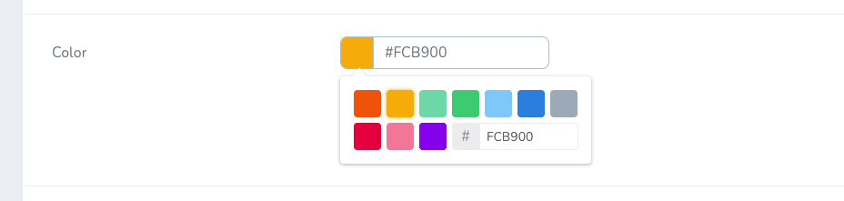
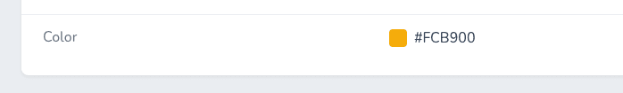

# Nova Color Field

[](https://packagist.org/packages/outl1ne/nova-color-field)
[](https://packagist.org/packages/outl1ne/nova-color-field)

This [Laravel Nova](https://nova.laravel.com/) package adds a color picker to Nova's arsenal of fields.

## Requirements

- `php: >=8.0`
- `laravel/nova: ^4.0`

## Features

A simple Nova Color field utilizing [vue-color](https://github.com/xiaokaike/vue-color).

Forked from [timothyasp/nova-color-field](https://github.com/timothyasp/nova-color-field) and brought up to date with improvements.

## Screenshots




## Installation

Install the package in to a Laravel app that uses [Nova](https://nova.laravel.com) via composer:

```bash
composer require outl1ne/nova-color-field
```

## Usage

### General

```php
use Outl1ne\NovaColorField\Color;

public function fields(Request $request) {
    Color::make('Color'),
}
```

### Themes

Available themes: `chrome, compactTheme, grayscale, material, photoshop, sketch, slider, swatches, twitter`.

See the theme demos [here](http://xiaokaike.github.io/vue-color/).

```php
use Outl1ne\NovaColorField\Color;

public function fields(Request $request) {
    Color::make('Color')->photoshop(),
    Color::make('Color')->swatches(),
    // ...
}
```

### Customizing save and display formats

If you would like to display and save the color in a format other than `hex`, you can use the `->displayAs('hex')` and `->saveAs('hex')` helpers.

Available options are: `rgb, rgba, hex, hex8, hsl`.

```php
Color::make('Color')
  ->chrome()
  ->displayAs('hex8')
  ->saveAs('hex8'),
```

### Palettes

Adding custom pallette colors to the pickers can be done like so:

```php
Color::make('Color')
  ->compactTheme()
  ->palette(['#beaf00', '#DEADAF', '#000']),
```

## Credits

- [Tarvo Reinpalu](https://github.com/tarpsvo)
- [Timothy Asp](https://github.com/timothyasp)
- [Don Gilbert](https://github.com/dongilbert)
- [marvinrabe](https://github.com/marvinrrabe)

## License

Nova Color Field is open-sourced software licensed under the [MIT license](LICENSE.md).
